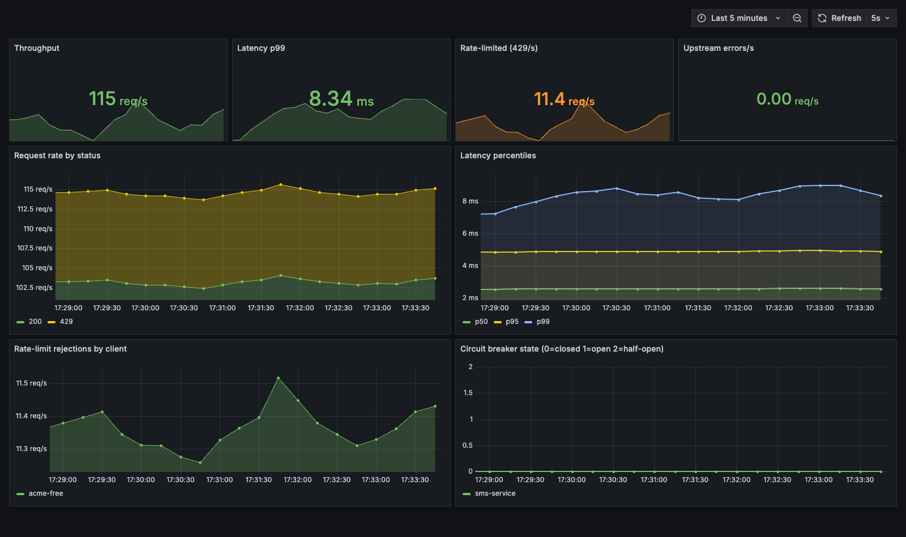
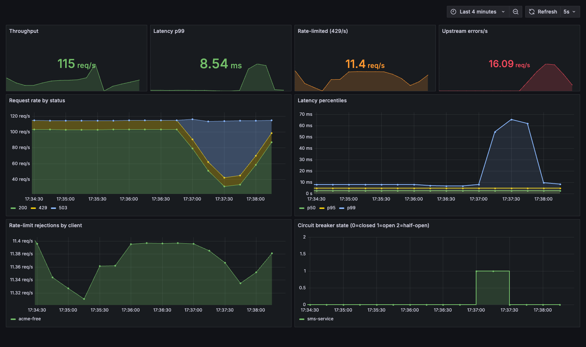

# api-gateway-rate-limiter

*[English](README.md) · Türkçe*

Go ile yazılmış, küçük ama **production-shaped** (gerçek dünyaya yakın) bir
**API gateway**. Arka plandaki servislerin önünde durup, bir operatörün
geliştirici API'lerini güvenle dışarı açarken ihtiyaç duyduğu ortak işleri
üstlenir: yönlendirme, kimlik doğrulama, **istemci bazında hız sınırlama**,
gözlemlenebilirlik ve düzgün kapanma.

> Bir telkonun public API'lerini (SMS, faturalama, konum) koruyup ölçen
> katmanı düşün — bu proje tam olarak onu modelliyor.

## Özellikler

- **Config'e dayalı reverse proxy** — upstream'lere path-prefix yönlendirme,
  en uzun prefix kazanır, rota bazında metot izin listesi, upstream bazında
  timeout.
- **API-key kimlik doğrulama** — bir anahtarı bir istemci ve plana çözer.
- **İstemci bazında hız sınırlama** — iki değiştirilebilir backend'li token
  bucket: **in-memory** (tek instance) ve **Redis + Lua** (dağıtık). Aşımda
  `Retry-After` ve `X-RateLimit-*` header'larıyla `429` döner.
- **Dayanıklılık** — upstream bazında **circuit breaker** (backend sağlıksızken
  hızlıca `503` döner) ve güvenli isteklerde **üstel bekleme ile sınırlı
  retry**.
- **Gözlemlenebilirlik** — `/metrics`'te Prometheus metrikleri, request-ID'li
  yapısal (`slog`) loglama, `/healthz` canlılık ucu.
- **Sağlam işletim** — panic recovery, upstream hataları `502` olarak yansır,
  limiter arızasında *fail-open*, SIGTERM'de graceful shutdown.
- **Kendi kendine yeten demo** — sahte upstream + `docker-compose` tüm yığını
  (gateway + Redis + upstream) tek komutla ayağa kaldırır.

## Mimari

```
İstemci ──▶ Gateway ─────────────────────────▶ Upstream (sms-service)
             │
             ├─ recovery      panic → 500, sunucu ayakta kalır
             ├─ request-id    her isteğe X-Request-ID
             ├─ metrics       Prometheus sayaç + gecikme histogramı
             ├─ logging       method, path, status, gecikme, client
             ├─ auth          X-API-Key → client + plan (yoksa 401)
             ├─ rate limit    token bucket (memory | redis) → 429
             └─ proxy         httputil.ReverseProxy → upstream
                              └─ dayanıklı transport: circuit breaker + retry
```

`/healthz` ve `/metrics` auth ve hız sınırlamayı atlar.

## Yerelde çalıştırma (Docker'sız)

Repo kökünden üç terminal:

```bash
# 1. sahte backend
go run ./cmd/upstream --addr :9001 --name sms-service

# 2. gateway (varsayılan olarak in-memory hız sınırlama)
go run ./cmd/gateway --config gateway.yaml
```

```bash
# 3. istek gönder
curl -s -H "X-API-Key: demo-free-key" localhost:8080/v1/sms/send
# {"method":"GET","path":"/v1/sms/send","service":"sms-service",...}

curl -s -o /dev/null -w "%{http_code}\n" localhost:8080/v1/sms/send          # 401 (anahtar yok)
curl -s -o /dev/null -w "%{http_code}\n" -X DELETE -H "X-API-Key: demo-free-key" localhost:8080/v1/sms  # 405

# limiter'ı izle: free plan burst 10, saniyede 5 dolar
for i in $(seq 1 15); do
  curl -s -o /dev/null -w "%{http_code} " -H "X-API-Key: demo-free-key" localhost:8080/v1/sms/send
done; echo
# 200 ×10 sonra 429 ×5

curl -s localhost:8080/healthz          # ok
curl -s localhost:8080/metrics | grep gateway_
```

## Docker ile çalıştırma (Redis destekli, dağıtık sınırlama)

```bash
docker compose up --build
# gateway :8080'de, Redis token-bucket backend'i ile
```

Compose; Redis, sahte upstream ve gateway'i `deploy/gateway.docker.yaml`
(`ratelimit.backend: redis`) ile birbirine bağlı şekilde ayağa kaldırır.

## Yapılandırma

Bkz. [`gateway.yaml`](gateway.yaml). Öne çıkanlar:

```yaml
ratelimit:
  backend: memory        # veya "redis"
  redis_addr: localhost:6379

plans:                   # rate = saniyedeki token, burst = kova kapasitesi
  free: { rate: 5,   burst: 10 }
  pro:  { rate: 100, burst: 200 }

clients:
  - { api_key: "demo-free-key", name: "acme-free",  plan: free }
  - { api_key: "demo-pro-key",  name: "globex-pro", plan: pro }
```

Upstream bazında dayanıklılık opsiyoneldir (opt-in):

```yaml
upstreams:
  - name: sms-service
    target: "http://localhost:9001"
    timeout: 3s
    retry:
      max_attempts: 2       # GET/HEAD için ek deneme, üstel bekleme
      backoff: 50ms
    circuit_breaker:
      failure_threshold: 5  # 5 ardışık hatadan sonra devreyi aç
      cooldown: 5s          # sonra tek bir half-open deneme ile toparlanmayı yoklar
```

Config başlangıçta doğrulanır: bilinmeyen upstream/plan referansları, hatalı
target veya süreler ve tekrarlanan anahtarlar açık bir hatayla reddedilir.

## Tasarım kararları

- **Neden token bucket** — `burst`'e kadar kısa ani yüklere izin verirken
  uzun vadeli hızı `rate`'te tutar; bu, katı sabit-pencere sınırına göre API
  trafiğine daha uygundur (pencere sınırında ani sıçrama olmaz).
- **Neden Redis + Lua** — birden fazla gateway kopyası varken sınır paylaşımlı
  olmalı, bu yüzden sayaç Redis'te tutulur. Doldur-kontrol-et-yaz adımı tek bir
  **Lua script** olarak atomik çalışır; eşzamanlı istekler kovada yarışamaz.
  In-memory backend, tek instance çalıştırmalar ve testler için kullanılabilir
  kalır.
- **Fail-open** — limiter backend'ine erişilemezse istek (loglanarak) geçirilir;
  böylece bir Redis kesintisi API'yi düşürmek yerine sadece ölçümü aksatır.
- **Kör retry yerine circuit breaker** — tamamen çökmüş bir upstream'i tekrar
  denemek sadece yük ekler. Breaker ardışık hatalardan sonra devreyi açıp
  hızlıca `503` döner, sonra tek bir half-open deneme ile toparlanmayı yoklar.
  Retry yalnızca *geçici* takılmaları kapsar ve sadece güvenli (GET/HEAD)
  isteklerde çalışır — böylece tekrar oynatılacak bir istek gövdesi olmaz.
- **Graceful shutdown** — SIGTERM'de sunucu yeni bağlantı kabul etmeyi durdurur
  ve akıştaki istekleri bir süre içinde bitirmelerine izin verir.

## Gözlemlenebilirlik

Gateway, Prometheus metriklerini `/metrics` üzerinden sunar.
[`deploy/observability/`](deploy/observability/) altındaki hazır yığın bu
metrikleri Prometheus'a ve provision edilmiş bir Grafana dashboard'una bağlar,
ayrıca küçük bir load generator ile gateway'e trafik sürerek panelleri canlı
verilerle doldurur:

```bash
docker compose -f deploy/observability/docker-compose.yml up --build
# Grafana:    http://localhost:3000   (anonim admin, giriş yok)
# Prometheus: http://localhost:9090
```

**Kararlı durum** — pro plan (`200`ler) ile limitine takılan free plan (`429`lar)
arasında bölünmüş ~115 req/s, tek haneli milisaniye p99 gecikmesi, kapalı devre:



**Arıza enjeksiyonu** — sahte upstream trafik akarken durdurulur. Circuit breaker
açılır (durum `0 → 1`), böylece istekler ölü bir backend üzerinde birikmek yerine
`503` ile hızlıca başarısız olur ve gecikme yalnızca kısa süre sıçrar; upstream
geri geldiğinde devre kendiliğinden kapanır (`1 → 0`) ve `200`ler döner:



## Performans

Dahili load generator, proxy yolu, her şey tek laptopta bir arada:

| throughput | p50 | p95 | p99 | hata |
|------------|-----|-----|-----|------|
| ~2.900 req/s | ~4 ms | ~54 ms | ~63 ms | 0 |

Tekrarlamak için bkz. [`loadtest/`](loadtest/).

## Test

```bash
go test -race ./...
```

Kapsam: config doğrulama, her iki limiter backend'i (Redis/Lua yolu, süreç-içi
[miniredis](https://github.com/alicebob/miniredis) üstünde çalışır), API-key
auth, proxy yönlendirme/metot davranışı, circuit-breaker durum makinesi ve
retry/circuit davranışının uçtan uca doğrulanması. CI her push'ta gofmt, vet,
build ve race'li testleri çalıştırır.

## Dizin yapısı

```
cmd/gateway        gateway giriş noktası (bağlama + graceful shutdown)
cmd/upstream       yerel test için sahte backend
internal/config    YAML yükleme + doğrulama
internal/proxy     reverse-proxy yönlendirici
internal/middleware recovery, request-id, logging
internal/auth      API-key → client/plan
internal/ratelimit token bucket (memory + redis/lua) + middleware
internal/breaker   circuit breaker durum makinesi
internal/metrics   Prometheus toplayıcıları
internal/reqctx    zincir boyunca paylaşılan istek bağlamı
loadtest/          load generator + vegeta hedefleri
deploy/            Docker/compose config
```

## Lisans

[MIT](LICENSE) © Ahmet Hasan Aygün
